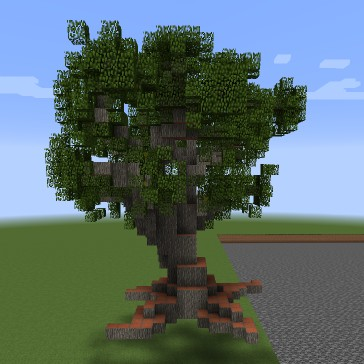
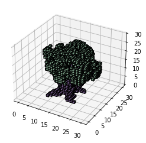

Official code for the paper: [Growing 3D Artefacts and Functional Machines with Neural Cellular Automata](https://arxiv.org/abs/2103.08737)
==================


### Video of more results: https://www.youtube.com/watch?v=-EzztzKoPeo

---


Requirements
----
- python3.8
- This package automatically install `test-evocraft-py`, but for further functionality follow installation steps here: https://github.com/real-itu/Evocraft-py

Installation
---------------
### For general installation
```
python setup.py install
```
### For ray tune + mlflow
```
python -m pip install -r ray-requirements.txt
python setup.py install
```

Usage
-------------
Make sure an evocraft-py server is running, either with `test-evocraft-py --interactive` or by following the steps in https://github.com/real-itu/Evocraft-py.

### Configs
Each nca is trained on a specific structure w/ hyperparams and configurations defined in yaml config, which we use with [hydra](https://github.com/facebookresearch/hydra) to create the [NCA trainer class](artefact_nca/trainer/voxel_ca_trainer.py).

[Example Config](pretrained_models/PlainBlacksmith/plain_blacksmith.yaml) for generating a "PlainBlacksmith" Minecraft Structure:
```
trainer:
    name: PlainBlacksmith
    min_steps: 48
    max_steps: 64
    visualize_output: true
    device_id: 0
    use_cuda: true
    num_hidden_channels: 10
    epochs: 20000
    batch_size: 5
    model_config:
        normal_std: 0.1
        update_net_channel_dims: [32, 32]
    optimizer_config:
        lr: 0.002
    dataset_config:
        nbt_path: artefact_nca/data/structs_dataset/nbts/village/plain_village_blacksmith.nbt

defaults:
  - voxel
```


## Generation and Training
### See [generation notebook](notebooks/GenerateStructures.ipynb) for ways to load in a pretrained nca and generate a structure in minecraft

### See [training notebook](notebooks/Training.ipynb) for ways to train an nca

## CLI training
```
python artefact_nca/train.py config={path to yaml config} trainer.dataset_config.nbt_path={absolute path to nbt file to use}
```
Example:
```
python artefact_nca/train.py config=pretrained_models/PlainBlacksmith/plain_blacksmith.yaml trainer.dataset_config.nbt_path=/home/shyam/Code/3d-artefacts-nca/artefact_nca/data/structs_dataset/nbts/village/plain_village_blacksmith.nbt
```

## Spawning in minecraft
See [generation notebook](notebooks/GenerateStructures.ipynb) for more details
### Example spawning the oak tree
1. Load in a trainer
```
from artefact_nca.trainer.voxel_ca_trainer import VoxelCATrainer

nbt_path = {path to repo}/artefact_nca/data/structs_dataset/nbts/village/Extra_dark_oak.nbt
ct = VoxelCATrainer.from_config(
                    "{path to repo}/pretrained_models/Extra_dark_oak/extra_dark_oak.yaml",
                    config={
                        "pretrained_path":"{path to repo}/pretrained_models/Extra_dark_oak/Extra_dark_oak.pt",
                        "dataset_config":{"nbt_path":nbt_path},
                        "use_cuda":False
                    }
                )
```
2. Create `MinecraftClient` to view the growth of the structure in Minecraft at position (-10, 10, 10) (x, y, z)
```
from artefact_nca.utils.minecraft import MinecraftClient
m = MinecraftClient(ct, (-10, 10, 10))
```
3. Spawn 100 iterations and display progress every 5 time steps
```
m.spawn(100)
```
Output should look like this:


## Structures
see [data directory](artefact_nca/data/structs_dataset/nbts). To view structures and spawn in minecraft see [generation notebook](notebooks/GenerateStructures.ipynb). An example of spawning and viewing the Tree:
```
import matplotlib.pyplot as plt
from artefact_nca.utils.minecraft import MinecraftClient

base_nbt_path = {path to nbts}
nbt_path = "{}/village/Extra_dark_oak.nbt".format(base_nbt_path)

 # spawn at coords (50, 10, 10)
blocks, unique_vals, target, color_dict, unique_val_dict = MinecraftClient.load_entity("Extra_dark_oak", nbt_path=nbt_path, load_coord=(50,10,10))

color_arr = convert_to_color(target, color_dict)

fig = plt.figure()
ax = fig.gca(projection='3d')
ax.voxels(color_arr, facecolors=color_arr, edgecolor='k')

plt.show()
```
This should spawn and display:

  

Authors
-------
Shyam Sudhakaran <shyamsnair@protonmail.com> <https://github.com/shyamsn97>

Djordje Grbic <djgr@itu.dk>, <https://github.com/djole>

Siyan Li <lisiyansylvia@gmail.com> <https://github.com/sli613>

Adam Katona <ak1774@york.ac.uk> <https://github.com/adam-katona>

Elias Najarro <https://github.com/enajx>

Claire Glanois <https://github.com/claireaoi>
 
Sebastian Risi <sebr@itu.dk> <https://github.com/sebastianrisi>
